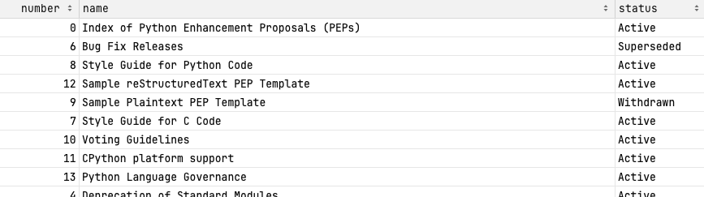
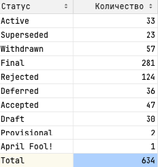

# Описание
Парсер предназначен для сбоора документов PEP с сайта https://peps.python.org/
Парсер написан с использованием фреймворка Scrapy. 
Парсер выводит собранную информацию в два файла .csv:

В первый файл выводит список всех PEP: номер, название и статус. Ниже приведен пример такого файла.

  
  Второй файл содержит сводку по статусам PEP — сколько найдено документов в каждом статусе (статус, количество). 
  В последней строке этого файла в колонке «Статус» должно стоять слово Total, а в колонке «Количество» — общее количество всех документов.
  
Пример файла:

    
## Запуск парсера

1. Клонируйте репозиторий:  
`git clone git@github.com:isv160179/scrapy_parser_pep.git`
2. Создайте и активируйте виртуальное окружение:  
`python -m venv venv`  
`source venv/bin/activate`  
3. Установите зависимости:  
`pip install -r requirements.txt`
4. Запустите парсер:  
`scrapy crawl pep`